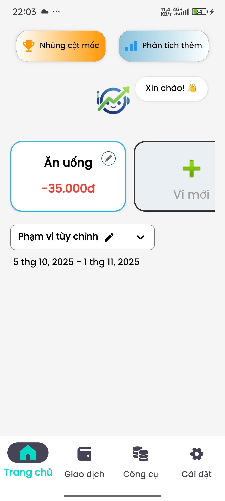
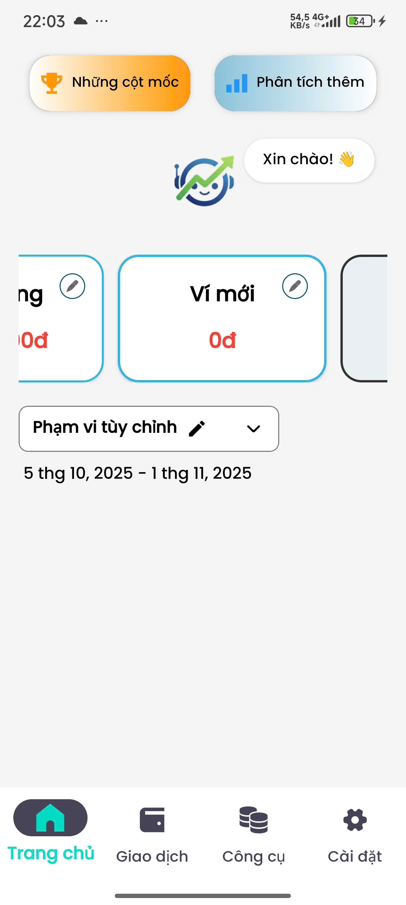
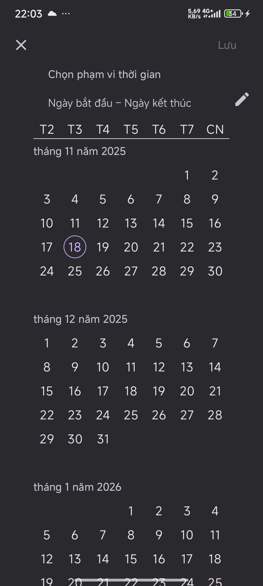

# 💸 LamThem_MaterialDesign3_FE_MoneyTrack

**MoneyTrack** là module giao diện người dùng (UI) dành cho ứng dụng quản lý tài chính cá nhân, được thiết kế và xây dựng dựa trên ngôn ngữ thiết kế mới nhất của Google: **Material Design 3**. Dự án tập trung vào sự tối giản, tính tương tác cao và trải nghiệm mượt mà trên các thiết bị Android hiện đại.

-----

## 📱 Demo Giao diện

https://github.com/user-attachments/assets/705fdddd-02e6-4751-b57f-689163d893b3

<p align="center">
  
  
  

</p>
-----

## ✨ Điểm nổi bật về Thiết kế (Material Design 3)

Dự án này không chỉ là việc sắp xếp các View, mà là sự áp dụng triệt để các nguyên lý của Material 3 nhằm tạo ra sự đồng bộ và hiện đại:

### 1\. Hệ thống Card (Material Cards)

Sử dụng `MaterialCardView` làm thành phần chứa chính (Container) với các đặc điểm nhận diện MD3:

  * **Bo góc lớn (Corner Radius):** Các thẻ như "Những cột mốc", "Phân tích thêm" sử dụng bo góc `18dp`, tạo cảm giác mềm mại, thân thiện.
  * **Stroke & Elevation:** Thay vì lạm dụng bóng đổ (shadow), giao diện sử dụng đường viền mỏng (Stroke) kết hợp với màu nền (Surface colors) để phân cấp nội dung (ví dụ: thẻ chọn ngày).
  * **Trạng thái (States):** Hiệu ứng Ripple và thay đổi Stroke color khi người dùng chọn Ví tiền (`selectWallet`).

### 2\. Bộ chọn thời gian (Material Date Range Picker)

Tích hợp thành phần `MaterialDatePicker` chuẩn Google:

  * **Full-screen Dialog:** Hỗ trợ giao diện lịch trực quan, tối ưu cho thao tác cảm ứng.
  * **Range Selection:** Cho phép chọn khoảng thời gian (Ngày bắt đầu - Ngày kết thúc) một cách chính xác.
  * **Localization:** Định dạng ngày tháng tự động theo ngôn ngữ Tiếng Việt (`5 thg 10, 2025`).

### 3\. Điều hướng & Bố cục

  * **Bottom Navigation Bar:** Thanh điều hướng dưới cùng tuân thủ chuẩn chiều cao và icon size của Material Guidelines.
  * **Nested Scrolling:** Sử dụng `NestedScrollView` kết hợp `CoordinatorLayout` để đảm bảo trải nghiệm cuộn mượt mà, không bị xung đột sự kiện.

-----

## 🛠️ Stack Kỹ thuật

  * **Ngôn ngữ:** Java (Android Native)
  * **Thư viện UI:** `com.google.android.material:material`
  * **Layout:** `ConstraintLayout`, `CoordinatorLayout`, `NestedScrollView`.
  * **Logic xử lý:** `Fragment` lifecycle, `LayoutInflater` để sinh giao diện động (Dynamic UI generation).

-----

## 💡 Phân tích Logic Code

### Xử lý Date Picker (Material 3)

Logic hiển thị và format ngày tháng được xử lý gọn gàng, sử dụng `Pair` để lưu trữ khoảng thời gian:

```java
private void showDateRangePicker() {
    // Khởi tạo Builder theo chuẩn Material
    MaterialDatePicker.Builder<Pair<Long, Long>> builder =
            MaterialDatePicker.Builder.dateRangePicker();
    builder.setTitleText("Chọn phạm vi thời gian");

    final MaterialDatePicker<Pair<Long, Long>> datePicker = builder.build();

    // Xử lý sự kiện Save
    datePicker.addOnPositiveButtonClickListener(selection -> {
        Long startDate = selection.first;
        Long endDate = selection.second;

        // Format ngày tháng chuẩn Việt Nam
        SimpleDateFormat sdf = new SimpleDateFormat("d 'thg' M, yyyy", new Locale("vi", "VN"));
        String result = sdf.format(new Date(startDate)) + " - " + sdf.format(new Date(endDate));
        
        tvSelectedDate.setText(result);
    });

    datePicker.show(getParentFragmentManager(), "DATE_PICKER");
}
```

### Xử lý chọn Ví (Dynamic Interaction)

Thay vì dùng ListView cứng nhắc, hệ thống Ví được thêm động (`addView`) và xử lý trạng thái "Selected" bằng cách thay đổi Stroke:

```java
private void selectWallet(MaterialCardView card) {
    // Reset trạng thái thẻ cũ
    if (selectedCard != null) {
        selectedCard.setStrokeWidth(0);
    }
    // Highlight thẻ mới được chọn (Màu xanh, viền dày)
    card.setStrokeColor(getResources().getColor(android.R.color.holo_blue_light));
    card.setStrokeWidth(6);
    selectedCard = card;
}
```

-----

## 🚀 Cài đặt và Chạy

1.  Clone dự án về máy.
2.  Mở bằng **Android Studio**.
3.  Đảm bảo file `build.gradle` đã bao gồm dependency:
    ```groovy
    implementation 'com.google.android.material:material:1.x.x'
    ```
4.  Sync Gradle và chạy trên máy ảo hoặc thiết bị thật.

-----

**Developed by [JulianNguyen - Nguyễn Hữu Trọng]**
*Một dự án thực hành tư duy thiết kế Material Design 3.*