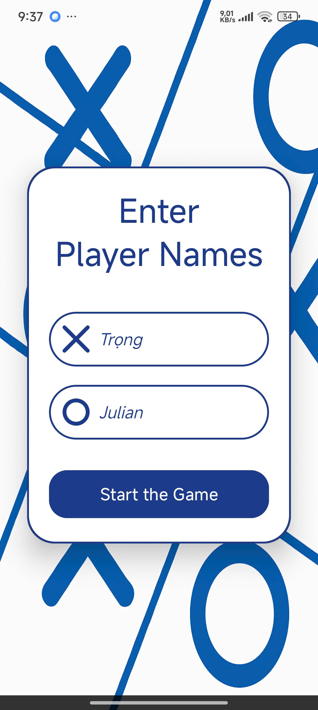
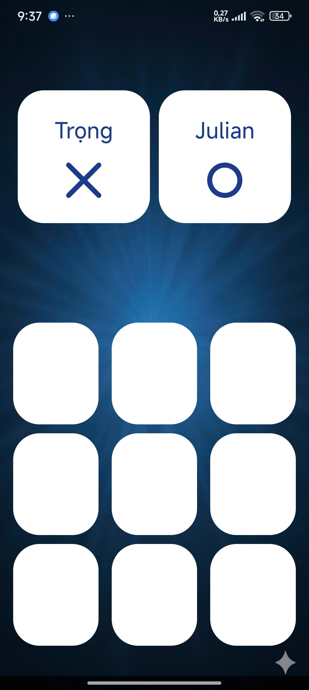
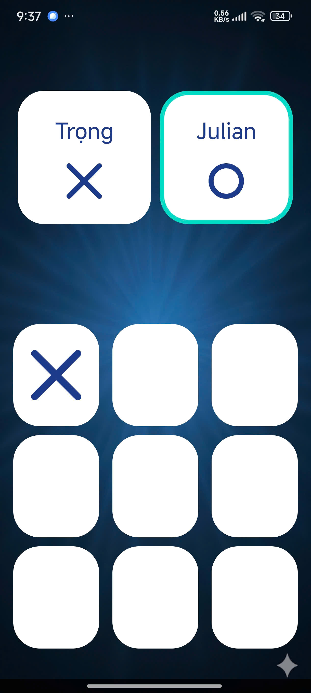
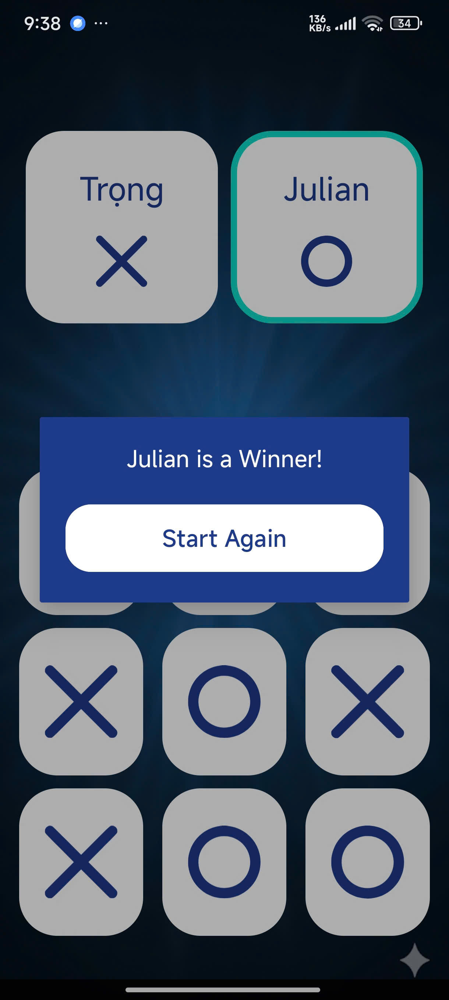

# 🎥 Demo Video

https://github.com/user-attachments/assets/831358b3-edac-458b-acb5-bd94efe85b77

---

# 📌 LamThem TicTacToe

## 📝 Introduction
The **purpose** of this project is to build a simple **Tic Tac Toe (X-O)** game using **Java** and **Android Studio**.  
It demonstrates **event-driven programming**, **UI handling**, and **activity lifecycle management**.

---

## Design Language

🎨 **Primary Color**: `cosmic_blue`

  ```java
  <color name="cosmic_blue">#1E3A8A</color>
  ```

  - **Hex Code**: `#1E3A8A`

  - **Style**: A deep cosmic navy blue.

  - **Purpose**:

    * Used as the **primary theme color** across activities and UI components.

    * Creates a **modern**, **elegant**, and **immersive** atmosphere for the game.

    * Enhances **readability** and **contrast** when combined with white or accent icons (X, O).

This color represents **focus**, **stability**, and **clarity**, aligning with the minimalistic yet competitive nature of Tic-Tac-Toe.

---

## Features

  - 🧑‍🤝‍🧑 **Add Players Screen** → Collects player names before starting.

  - 🎲 **Game Board UI** → Interactive X/O grid with click-based logic.

  - 🏆 **Result Dialog** → Displays the winner or draw result.

  - 🎨 **Custom UI Components** → Borders, shapes, and drawable icons for X and O.

  - 📱 **Material Design** with `AppCompatActivity` for lifecycle and compatibility.

---

## Technical Stack

  - **Language**: Java

  - **IDE**: Android Studio

  - **Build System**: Gradle (Kotlin DSL)

  - **UI Framework**: AndroidX with ViewBinding

  - **Libraries**:

    * `androidx.appcompat:appcompat` → Core for `AppCompatActivity`.

    * Custom XML drawables (`cosmic_blue_border.xml`, `tear_200_border.xml`, etc.).

---

## Project Structure

📂 **File Tree**

```java
lamthemTicTacToe
├── app/
│   ├── src/
│   │   ├── main/
│   │   │   ├── java/th/nguyenhuutrong/lamthemtictactoe/
│   │   │   │   ├── AddPlayers.java
│   │   │   │   ├── MainActivity.java
│   │   │   │   └── ResultDialog.java
│   │   │   ├── res/
│   │   │   │   ├── drawable/      # custom borders, icons (X, O)
│   │   │   │   ├── layout/        # activity XML layouts
│   │   │   │   ├── mipmap/        # launcher icons
│   │   │   │   ├── values/        # colors, strings, themes
│   │   │   │   └── values-night/  # night mode themes
│   │   │   └── AndroidManifest.xml
│   │   └── test/ & androidTest/   # unit and instrumented tests
├── gradle/                        # gradle wrapper and configs
├── build.gradle.kts               # project build script
└── README.md                      # project documentation

```

---

## Getting Started

**Prerequisites**

  - **Android Studio** (latest version)
  - **Java 8+**
  - **Android SDK 24+**

**Installation**
This project is part of a larger repository: 

```git
git clone https://github.com/JulianNguyen05/Android_Application.git
cd Android_Application
```

---

## 🎮 Demo

Here are some screenshots of the **LamThem TicTacToe** game in action:

---

### 🖼️ Image 1 – Add Players Screen  
- Players enter their names before starting the game.  
- Example: "Trọng" and "Julian".  
- The UI uses **custom borders** (`cosmic_blue_border.xml`) and the **primary cosmic blue color**.  
<p align="center">
  
</p>

---

### 🖼️ Image 2 – Post Player Setup  
- After adding players, their names and assigned symbols (X or O) are displayed.  
- Player order is initialized here.  
<p align="center">
  
</p>

---

### 🖼️ Image 3 – TicTacToe Game Board  
- The 3x3 grid is displayed with rounded white boxes.  
- Players take turns tapping on empty cells.  
- Each symbol (X or O) is rendered using **drawable vector resources** (`ic_x.xml`, `ic_o.xml`).  
<p align="center">
  
</p>

---

### 🖼️ Image 4 – Player X Starts (Your Uploaded Example)  
- **Player X ("Trọng")** has made the first move.  
- A **highlight border** shows that it is now **Player O ("Julian")**’s turn.  
<p align="center">
  
</p>

---

### 🖼️ Image 5 – Turn Switching to Player X  
- After Player O plays, the border highlight switches back to Player X.  
- This alternates until the game ends.  
<p align="center">
  
</p>

---

### 🖼️ Image 6 – Victory Announcement  
- When a player completes a row, column, or diagonal:  
  - A **Result Dialog** (`ResultDialog.java`) pops up.  
  - Announces the **winner** with their name and symbol.  
<p align="center">
  
  &nbsp;&nbsp;&nbsp;
  
</p>

---

### 🖼️ Image 7 – Draw Announcement  
- If all 9 cells are filled without a winner:  
  - The **Result Dialog** shows a **draw message**.  
  - Players can choose to restart or exit the game.  
<p align="center">
  
</p>

---

# 🧮 Important Algorithms

This project uses several core algorithms to control **the Tic-Tac-Toe game mechanics**, **player management**, and **result display**. Below are the most important algorithms written in **pseudocode**.

---

## Player Input & Validation (`AddPlayers.java`)
**Algorithm: Validate and Pass Player Names**

```pseudo
INPUT: playerOneName, playerTwoName
IF playerOneName IS EMPTY OR playerTwoName IS EMPTY THEN
    SHOW error message: "Both players must enter names"
ELSE
    CREATE Intent → MainActivity
    PUT playerOneName, playerTwoName into Intent
    START MainActivity
END IF
```

---

## Initialize Game Board (`MainActivity.java`)
**Algorithm: Initialize 3x3 Board**

```pseudo
CREATE 2D ARRAY board[3][3]
FOR i = 0 TO 2
    FOR j = 0 TO 2
        board[i][j] ← EMPTY
    END FOR
END FOR
SET playerOneTurn ← TRUE   // Player X starts first
```

---

## Handle Player Move (`MainActivity.java`)
**Algorithm: Player Move & Switch Turns**

```pseudo
FUNCTION onCellClick(cell):
    IF cell IS NOT EMPTY THEN
        RETURN   // Invalid move
    END IF

    IF playerOneTurn = TRUE THEN
        cell ← "X"
        board[row][col] ← "X"
    ELSE
        cell ← "O"
        board[row][col] ← "O"
    END IF

    CALL checkWinner()

    // Switch turn
    playerOneTurn ← NOT playerOneTurn
END FUNCTION
```

---

## Win Detection (`MainActivity.java`)
**Algorithm: Check Winner**
```pseudo
FUNCTION checkWinner():
    FOR each row i
        IF board[i][0] = board[i][1] = board[i][2] ≠ EMPTY THEN
            RETURN board[i][0]   // Winner found
    END FOR

    FOR each column j
        IF board[0][j] = board[1][j] = board[2][j] ≠ EMPTY THEN
            RETURN board[0][j]   // Winner found
    END FOR

    IF board[0][0] = board[1][1] = board[2][2] ≠ EMPTY THEN
        RETURN board[0][0]       // Diagonal win
    END IF

    IF board[0][2] = board[1][1] = board[2][0] ≠ EMPTY THEN
        RETURN board[0][2]       // Other diagonal win
    END IF

    RETURN NONE   // No winner yet
END FUNCTION
```

---

## Draw Detection (`MainActivity.java`)
**Algorithm: Check Draw**
```pseudo
FUNCTION checkDraw():
    FOR i = 0 TO 2
        FOR j = 0 TO 2
            IF board[i][j] = EMPTY THEN
                RETURN FALSE  // Still moves left
            END IF
        END FOR
    END FOR
    RETURN TRUE   // Board full → Draw
END FUNCTION
```

---

## Result Display (`ResultDialog.java`)
**Algorithm: Show Result Dialog**

```pseudo
FUNCTION showResult(resultMessage):
    CREATE Dialog with resultMessage
    ADD Button "Restart"
        ON CLICK:
            RESET board
            CLOSE dialog
    ADD Button "Exit"
        ON CLICK:
            FINISH activity
    DISPLAY dialog
END FUNCTION
```

---

## Restart Game (`MainActivity.java`)
**Algorithm: Reset Board**

```pseudo
FUNCTION resetGame():
    FOR i = 0 TO 2
        FOR j = 0 TO 2
            board[i][j] ← EMPTY
            CLEAR UI cell[i][j]
        END FOR
    END FOR
    SET playerOneTurn ← TRUE   // Always start with X
END FUNCTION
```

---

## Game Flow Overview
**Algorithm: Game Loop**

```pseudo
START Game
    CALL initializeBoard()
    WHILE TRUE
        WAIT for player move
        CALL onCellClick(cell)

        winner ← checkWinner()
        IF winner ≠ NONE THEN
            CALL showResult(winner + " Wins!")
            BREAK
        END IF

        IF checkDraw() = TRUE THEN
            CALL showResult("Draw!")
            BREAK
        END IF
    END WHILE
END Game
```

---

## ✅ The above algorithms ensure that:
  - The player enters the correct name and is transmitted to the game screen.

  - The rules of the game are followed (no override).

  - The order of moves always rotates X ↔ O.

  - Accurately detects wins/losses/draws.

  - Clearly displays results via `ResultDialog`.

  - The game can be restarted or terminated.

---

# 📚 Core Library: AppCompatActivity

## 🔹 Introduction
At the heart of Android’s modern application development lies the `AppCompatActivity` class, part of the **AndroidX AppCompat library**.
This class provides compatibility support for older versions of Android while giving access to the latest Material Design components and lifecycle handling.

Both `MainActivity.java` and `AddPlayers.java` in this project extend from `AppCompatActivity`, making it the **foundation for Activity-based UI components**.

---

## 🔹 Installation & Setup
Before using `AppCompatActivity`, you need to ensure your project is set up correctly:

### Step 1: Enable ViewBinding (optional but recommended)
In your `build.gradle (Module: app)` file, enable ViewBinding to simplify UI element references:

  ```java
  android {
    ...
    buildFeatures {
         viewBinding true
    }
  }
  ```
### Step 2: Add AndroidX AppCompat dependency
Most Android Studio templates already include this by default, but make sure the dependency is available:

  ```java
  dependencies {
    implementation 'androidx.appcompat:appcompat:1.7.0'
  }
  ```
### Step 3: Import in your Activity

  ```java
  import androidx.appcompat.app.AppCompatActivity;
  ```
---

## 🔹 Usage in This Project
🔹 **MainActivity.java**

  ```java
  public class MainActivity extends AppCompatActivity {
    @Override
    protected void onCreate(Bundle savedInstanceState) {
        super.onCreate(savedInstanceState);
        setContentView(R.layout.activity_main);
    }
  }
  ```

  - **Extended** `AppCompatActivity` → allows the activity to integrate with the Android lifecycle.

  - `onCreate()` **override** → initializes the UI using `setContentView`.

  - Provides **backward compatibility** for UI rendering across Android versions.

  - Enables access to modern Material Design components while running smoothly on older Android devices.

 🔹 **AddPlayers.java**

  ```java
  public class AddPlayers extends AppCompatActivity {
    @Override
    protected void onCreate(Bundle savedInstanceState) {
        super.onCreate(savedInstanceState);
        setContentView(R.layout.activity_add_players);
    }
  }
  ```

  - Just like `MainActivity`, it inherits `AppCompatActivity`.

  - Provides a dedicated **Activity screen for adding players**.

  - Uses **the same lifecycle management** (via `onCreate`).

  - By extending `AppCompatActivity`, it can later integrate menus, toolbars, fragments, or themes consistently.

---

## 🔹 Why AppCompatActivity?

  * ✅ **Backward Compatibility**: Works seamlessly on older Android versions.

  * ✅ **Lifecycle Support**: Manages `onCreate`, `onStart`, `onResume`, etc.

  * ✅ **UI Consistency**: Ensures Material Design works the same across devices.

  * ✅ **Fragment Support**: Simplifies integration with `FragmentManager`.

  * ✅ **Theme & Styling**: Works with `Theme.MaterialComponents` and custom styles.

---

## 🔹 Summary

  * In this project:

  * Both `MainActivity` and `AddPlayers` extend `AppCompatActivity`.

  * The library provides **activity lifecycle management, UI compatibility**, and **modern Android features**.

  * By enabling **ViewBinding** and importing **AppCompat**, the project gains clean code, stable performance, and long-term support.

---

# 👨‍💻 Author  

- **Nguyễn Hữu Trọng (Julian)**  