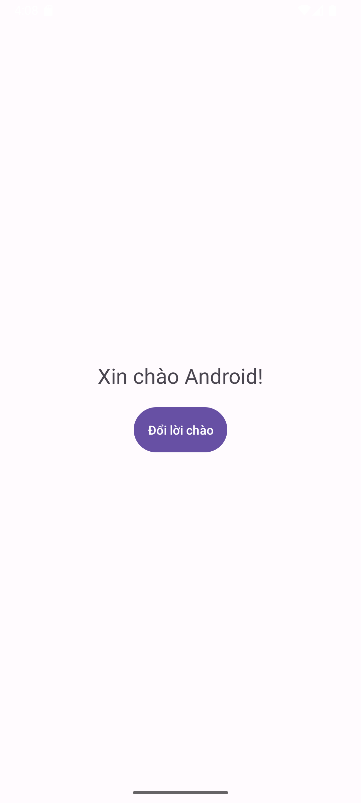
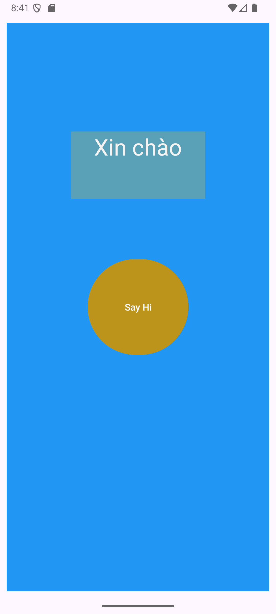
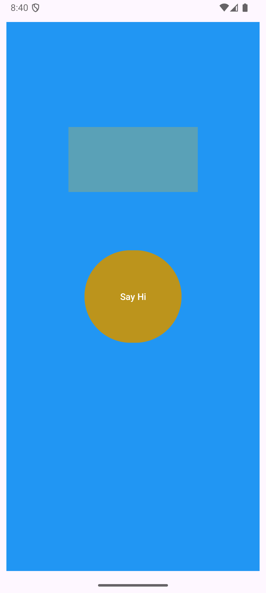
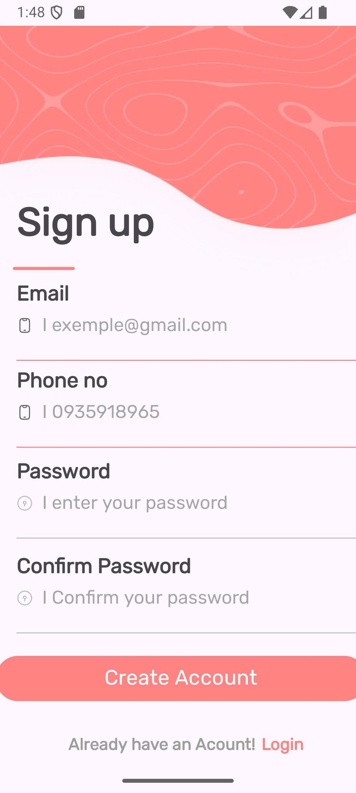
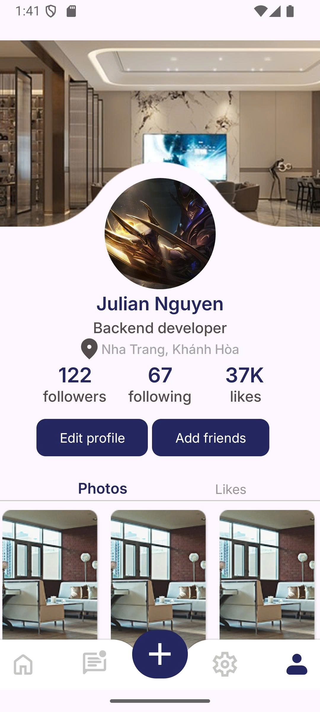
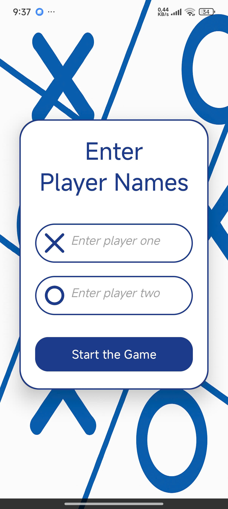

# 📱 Android Application Projects

## 📝 Introduction
This repository contains homework projects for the **Mobile Application Development** course.  
Each task is a small Android application built with **Java** to practice programming skills and to learn the process of building complete mobile apps.

---

## 🚀 Technologies Used
- **Language:** Java  
- **IDE:** Android Studio  
- **SDK:** Android SDK 24+  

---

## 📌 Tasks

### 🔹 [Task 1 - Hello Android](./Task1_HelloWorld/README.md)
A simple Android application that displays a greeting message and allows switching between **English** and **Vietnamese** greetings with a button.

  
  

> *(Click the title to see the detailed README with more screenshots and a video demo)*

---

### 🔹 [Vi Du Layout 1](./ViDuLayOut1/README.md)
- Display a screen with a **"Say Hi"** button
- When the user presses the button, the application will display the text **"Xin chào"** on the screen.

  
  

> *(Click the title to see the detailed README with more screenshots and a video demo)*

---

### 🔹 [TH Simple Layout](./TH_Simple_Layout//README.md)
A **UI-only** Android project that recreates a modern **Sign Up screen** with Material Design components (TextInputLayout, buttons, social login).  
Original design: [Figma – Simple Login (Community)](https://www.figma.com/design/OfwHhZbvlj9otXUpt6lRnA/Simple-Login-%E2%9C%A8--Community-?node-id=0-1&p=f&t=ls6BkuNyAwiTsPtd-0)

> *(Click the title to see the detailed README with more screenshots)*

---

### 🔹 [TH Simple Layout 2](./TH_Simple_Layout_2//README.md)
An Android project demonstrating a **Profile / User Settings UI**, including avatar, user details, stats, gallery, and bottom navigation bar.  
Original design: [Figma – User Profile / Settings Screen (Community)](https://www.figma.com/design/g1rrN0CfyUw2hso9TwsF2V/User-profile---Settings-screen--Community-?node-id=11-2369&t=GbthtR7QklAYM5gL-0)

> *(Click the title to see the detailed README with more screenshots)*

---

### 🔹 [LamThem Tic Tac Toe](./lamthemTicTacToe//README.md)
A **Tic Tac Toe (X-O) game project** built with **Java** and **Android Studio**, using **AppCompatActivity** for modern activity features and backward compatibility.  
- 🧑‍🤝‍🧑 **Add Players screen**: input names for Player One and Player Two.  
- ▶️ **Start Game button** to begin the match.  
- 🎲 Upcoming features: interactive **game board**, **result dialog**, and full **gameplay logic**.  

> *(Click the title to see the detailed README with more screenshots and a video demo)*

---

### 🔹 [LamThem Quizz App Total](./TH_Quizzapp_Total/README.md)
An interactive **Math Quiz Game** built with **Java** and **Android Studio**.  
- Displays random math questions with **score tracking**.  
- Supports **correct/wrong answer highlighting** (green/red).  
- Includes **animations**: blinking effect for correct answers, fade in/out transitions.  
- Demonstrates **event handling** and **UI/UX design** in Android.

> *(Click the title to see the detailed README with more screenshots and a video demo)*

---

### 🔹 [LamThem TH_Bai2_BasicGUI_BMI](./TH_Bai2_BasicGUI_BMI/README.md)
A modern Android application built with **Java** and **Android Studio** that calculates the **Body Mass Index (BMI)** and classifies results based on **Global** or **Asian** standards.  
- ⚙️ **Height & Weight input fields** with real-time validation.  
- 🌏 **Switch for Asian Standard** – toggle between WHO and Asian BMI categories.  
- 🎨 **Dynamic result colors**:
  - 🩵 Underweight → Blue  
  - 🟢 Normal → Green  
  - 🟠 Overweight → Orange  
  - 🔴 Obese → Red  
- 📊 Supports **custom fonts**, **ConstraintLayout UI**, and **color-coded feedback**.  
- 🧠 Demonstrates **logic-based condition handling** and **user interaction design** in Android.  

> *(Click the title to see the detailed README with more screenshots and a video demo)*

---