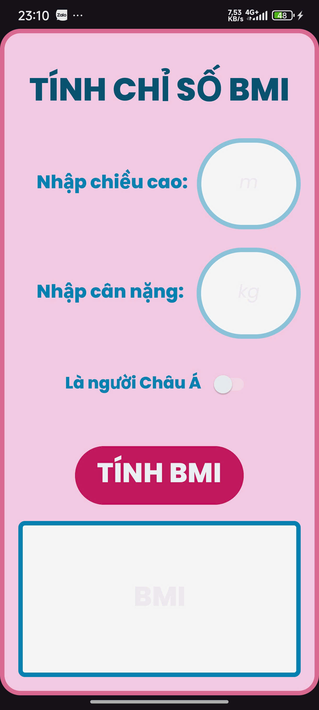
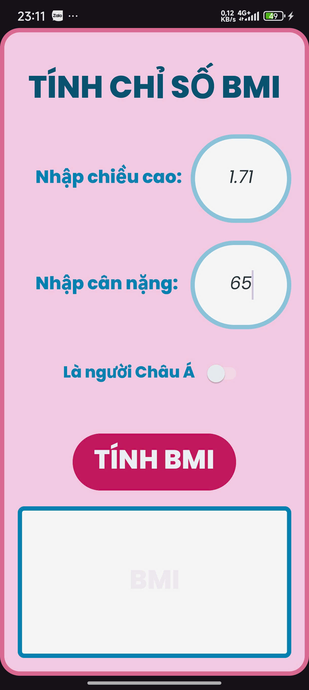
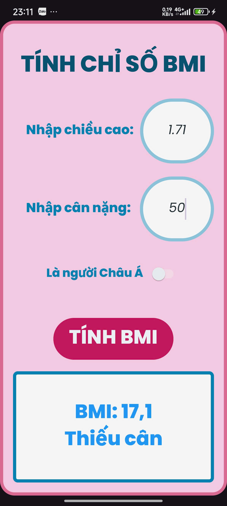
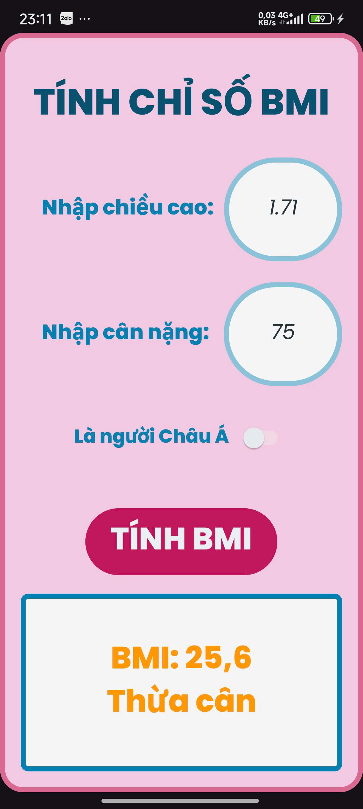
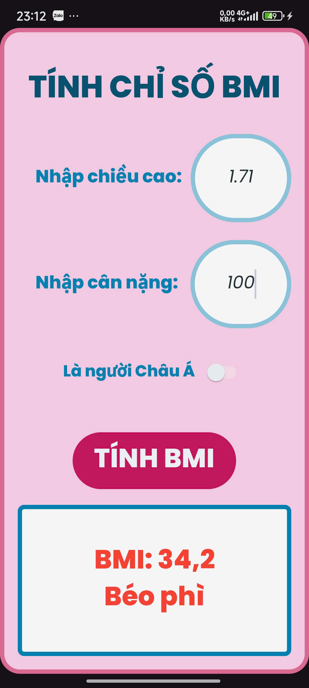
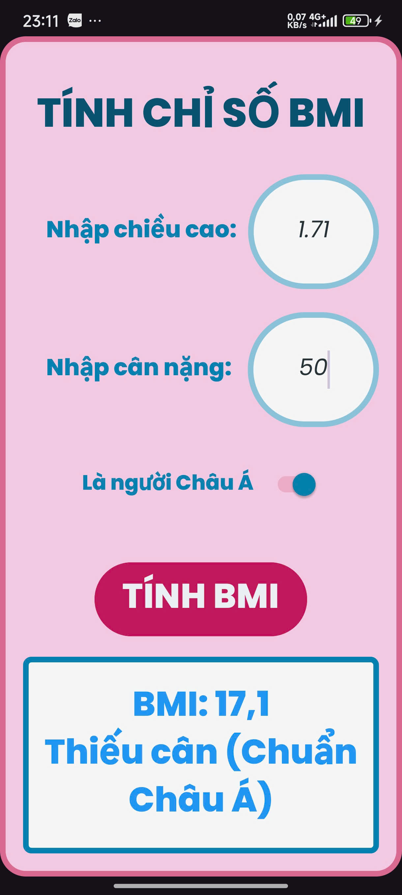
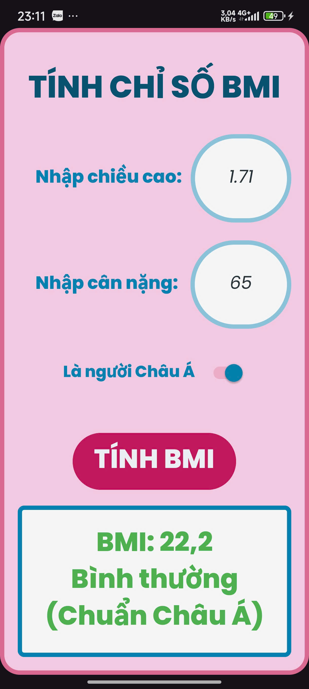
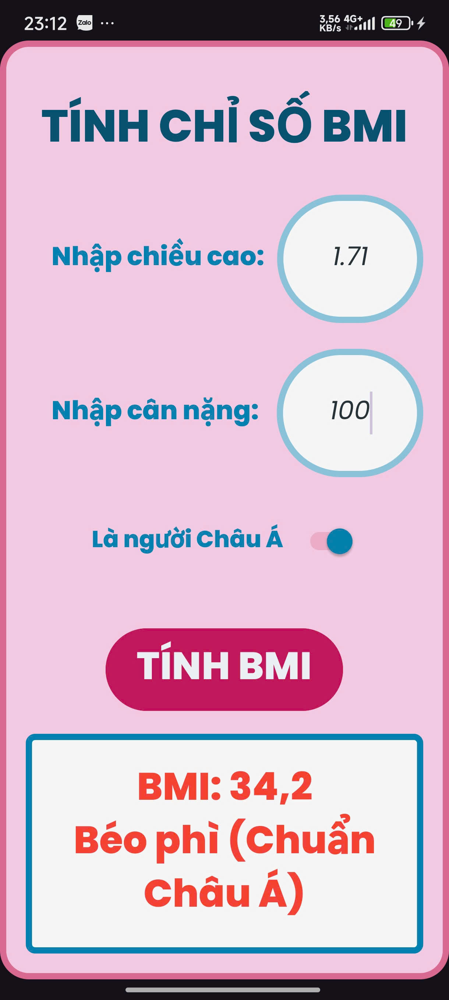

# 🎥 Demo Video

https://github.com/user-attachments/assets/f1f47c0e-b16e-4da3-9f29-ef4b71b01dd5

# LamThem TH_Bai2_BasicGUI_BMI

A modern Android application built with **Java** and **Android Studio** that calculates the **Body Mass Index (BMI)** and provides health classification based on either **Global** or **Asian** standards.  
This project was developed as part of the **Basic GUI Programming** course to practice form design, event handling, and conditional logic in Android.

---

## 📌 Features

* **Dynamic BMI Calculation** – Calculates BMI instantly after user input.  
* **Asian Standard Toggle** – Switch between global and Asian BMI classification.  
* **Colored Result Display** – Result text color changes by category:  
  * 🩵 Underweight → Blue  
  * 🟢 Normal → Green  
  * 🟠 Overweight → Orange  
  * 🔴 Obese → Red  
* **Validation Handling** – Alerts for empty or invalid input values.  
* **Responsive UI** – Clean layout adapting to different screen sizes.  
* **Custom Fonts and Colors** – Uses *Poppins* font and personalized color palette.

---

## 🛠️ Tech Stack

* **Language**: Java  
* **IDE**: Android Studio  
* **UI Framework**: XML Layout (ConstraintLayout + LinearLayout)  
* **Libraries**: AndroidX Core, AppCompat, ContextCompat  
* **Design Assets**: Custom drawables and color resources

---

## 🚀 Getting Started

### Prerequisites

* Android Studio (latest version recommended)
* JDK 11 or higher
* Android SDK 24+

### Installation

1. Clone this repository:

   ```bash
   git clone git@github.com:JulianNguyen05/Android_Application.git
   ```
2. Open the project in **Android Studio**.
3. Let Gradle sync and build the project.
4. Run the app on an emulator or physical device.

---

## 📸 Screenshots

### 1️⃣ Main Screen  
This is the **main interface** where the user can enter height and weight values before calculating BMI.  



---

### 2️⃣ isAsian = false (Global Standard)  
When the user leaves the switch **off**, BMI is calculated using the **Global WHO standard**.  



---

### 3️⃣ isAsian = true (Asian Standard)  
When the user toggles the switch **on**, BMI is calculated using the **Asian BMI standard**.  


---

### 4️⃣ Underweight (Global Standard)  
BMI is below the normal range according to the **Global standard**.  



---

### 5️⃣ Normal Weight (Global Standard)  
BMI falls in the normal range according to the **Global standard**.  


---

### 6️⃣ Overweight (Global Standard)  
BMI exceeds the normal range according to the **Global standard**.  



---

### 7️⃣ Obese (Global Standard)  
BMI indicates obesity based on the **Global standard**.  



---

### 8️⃣ Underweight (Asian Standard)  
BMI is below the normal range according to the **Asian standard**.  



---

### 9️⃣ Normal Weight (Asian Standard)  
BMI is in the normal range according to the **Asian standard**.  



---

### 🔟 Overweight (Asian Standard)  
BMI exceeds the normal range according to the **Asian standard**.  


---

### 1️⃣1️⃣ Obese (Asian Standard)  
BMI indicates obesity based on the **Asian standard**.  



---

## 🧑‍💻 Author

* **Nguyễn Hữu Trọng (Julian)**
  *Learning Android Development with Java*

---