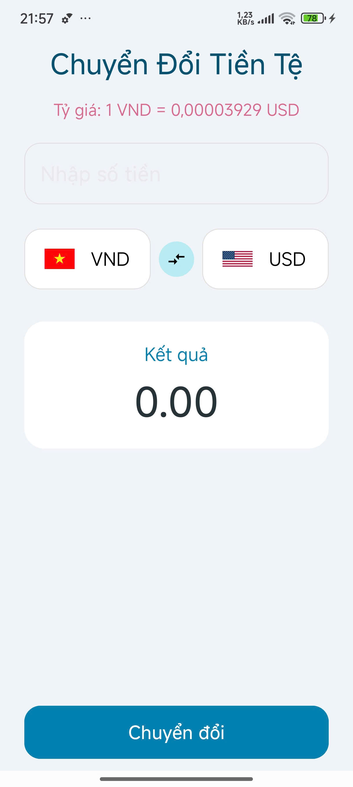
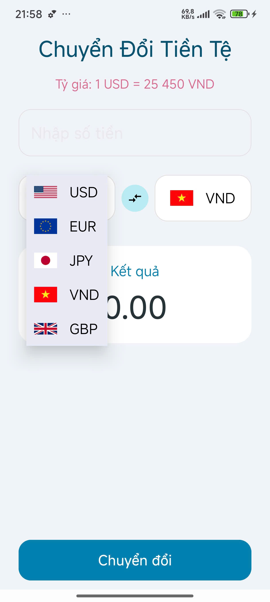
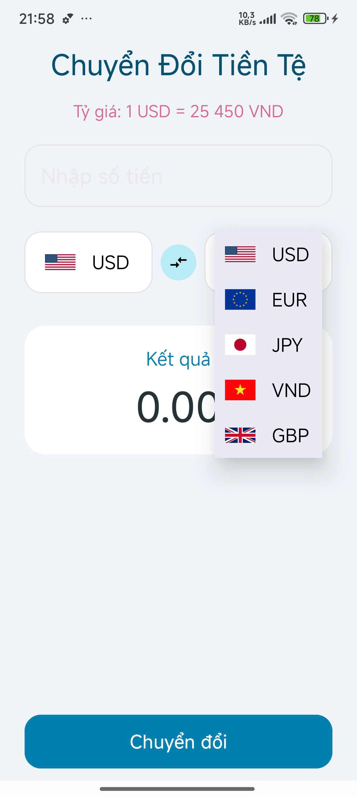
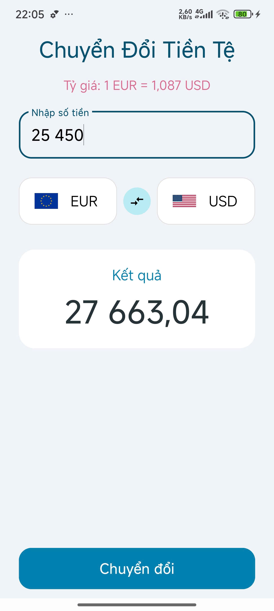

# Currency Converter Application

A native Android application built with Java that provides a fast, accurate, and user-friendly currency conversion tool. The app features a modern interface focused on a smooth user experience with smart features like automatic number formatting and dynamic exchange rate display.

## 🎬 Demo

*(This is where you can place a video or GIF demonstrating the app. You can record your screen, upload it to YouTube/Imgur, and paste the link here.)*

**[Your Demo Video Link Here]**

## 📸 Screenshots

### 1️⃣ Main Interface (Default)

The main user interface of the application, displaying the default currency pair selected on launch.

\

-----

### 2️⃣ Dynamic Exchange Rate Display

The exchange rate is automatically updated and displayed based on the currency pair selected by the user.

\

-----

### 3️⃣ "From" Currency Selection

The custom dropdown menu for selecting the "From" currency, featuring country flags for quick and intuitive identification.

\

-----

### 4️⃣ "To" Currency Selection

The custom dropdown menu for selecting the "To" currency, providing a consistent and smooth user experience.

\

-----

### 5️⃣ USD to VND Conversion

An example of a conversion from US Dollar to Vietnamese Dong, with the result automatically formatted with thousands separators.


-----

### 6️⃣ VND to USD High-Precision Conversion

Showcases the high-precision feature, accurately converting from Vietnamese Dong to US Dollar without rounding small decimals to zero.

\

-----

### 7️⃣ EUR to USD Conversion

Another conversion example from Euro to US Dollar, demonstrating the real-time calculation and result display.

\

-----


## ✨ Key Features

  * **Currency Conversion:** Supports conversion between 5 popular currencies: USD, VND, EUR, JPY, and GBP.
  * **Custom UI:** Spinners display country flags alongside currency names for quick and intuitive recognition.
  * **Dynamic Exchange Rate:** Automatically calculates and displays the direct exchange rate between the two selected currencies.
  * **High-Precision Handling:** Accurately displays very small exchange rates (e.g., 1 VND = 0.000039 USD) instead of rounding to zero.
  * **Automatic Number Formatting:** Automatically adds a thousands separator as the user types, making large numbers easier to read.
  * **Swap Functionality:** Allows users to easily swap the "From" and "To" currencies with a single tap on the swap icon.
  * **Modern Design:** Utilizes components from Google's Material Design library for a professional and consistent feel.

## 🎨 Color Palette

The color palette was carefully chosen to create a harmonious, modern, and visually appealing interface.

| Color | Hex Code | Description |
| :--- | :--- | :--- |
| Main Background | `#F0F4F8` | A light, blue-gray background for the entire application. |
| Primary Blue | `#2962FF` | The main accent color used for buttons, titles, and focused outlines. |
| Accent Pink | `#FF4081` | A vibrant pink used for the exchange rate text to make it stand out. |
| Charcoal Gray | `#36454F` | The primary text color for the conversion result, ensuring readability. |
| Dropdown Background | `#E8EAF6` | The background color for the spinner's dropdown list. |

## 🚀 Setup and Installation

To get this project up and running on your local machine, follow these steps.

#### Prerequisites

  * Android Studio (latest version recommended).
  * JDK 11 or higher.

### Installation

1.  Clone this repository:

    ```bash
    git clone git@github.com:JulianNguyen05/Android_Application.git
    ```

2.  Open the project in **Android Studio**.

3.  Let Gradle sync and build the project.

4.  Run the app on an emulator or physical device.

#### Key Components

This project relies on the Material Design library for advanced UI components. Ensure your `build.gradle` (Module: app) file includes the following dependency:

```groovy
implementation 'com.google.android.material:material:1.12.0' // Or a newer version
```

## 💡 Core Concepts & Code Snippets

These are the most important code segments that solve the core challenges of the application.

### 1\. Automatic Number Formatting (`NumberTextWatcher`)

To improve the user experience, the app automatically formats numbers with a thousands separator as the user types. This is achieved using a custom `TextWatcher` class.

```java
// Inside MainActivity.java
private static class NumberTextWatcher implements TextWatcher {
    private final EditText editText;
    private final DecimalFormat df;

    // ... constructor ...

    @Override
    public void afterTextChanged(Editable s) {
        // Remove the listener to prevent an infinite loop
        editText.removeTextChangedListener(this);
        try {
            String originalString = s.toString();
            if (!originalString.isEmpty()) {
                // Parse the string (with old formatting removed) into a number
                Number number = df.parse(originalString);
                // Reformat the number and update the EditText
                String formattedString = df.format(number);
                editText.setText(formattedString);
                editText.setSelection(formattedString.length());
            }
        } catch (ParseException e) {
            // Ignore parsing errors while the user is typing
        }
        // Re-add the listener
        editText.addTextChangedListener(this);
    }
}
```

### 2\. High-Precision Rate Display (Conditional Formatting)

To solve the issue of very small exchange rates being rounded to 0, the app uses conditional logic to select the appropriate number formatter based on the rate's value.

```java
// Inside MainActivity.java
private void updateExchangeRateDisplay() {
    // ... calculate directRate ...

    String formattedRate;
    // Conditional logic: if the rate is very small, use the high-precision formatter
    if (directRate > 0 && directRate < 0.01) {
        formattedRate = preciseRateFormatter.format(directRate);
    } else {
    // Otherwise, use the normal formatter
        formattedRate = normalRateFormatter.format(directRate);
    }

    String rateText = "Rate: 1 " + fromCode + " = " + formattedRate + " " + toCode;
    tvExchangeRate.setText(rateText);
}
```

### 3\. Custom Spinner with Flags (`CurrencyAdapter`)

A custom `ArrayAdapter` is used to display both a flag and the currency name in the spinner, rather than just plain text.

```java
// In CurrencyAdapter.java
public class CurrencyAdapter extends ArrayAdapter<CurrencyItem> {
    // ... constructor ...

    private View initView(int position, View convertView, ViewGroup parent) {
        if (convertView == null) {
            // Inflate the custom layout
            convertView = LayoutInflater.from(getContext()).inflate(
                    R.layout.spinner_item_with_flag, parent, false
            );
        }

        ImageView imageViewFlag = convertView.findViewById(R.id.ivFlag);
        TextView textViewName = convertView.findViewById(R.id.tvCurrencyName);
        CurrencyItem currentItem = getItem(position);

        if (currentItem != null) {
            // Set the data (flag and name) to the views
            imageViewFlag.setImageResource(currentItem.getFlagImage());
            textViewName.setText(currentItem.getCurrencyName());
        }

        return convertView;
    }
}
```

## 🧑‍💻 Author

  * **Nguyễn Hữu Trọng (Julian)**
    *Learning Android Development with Java*

-----