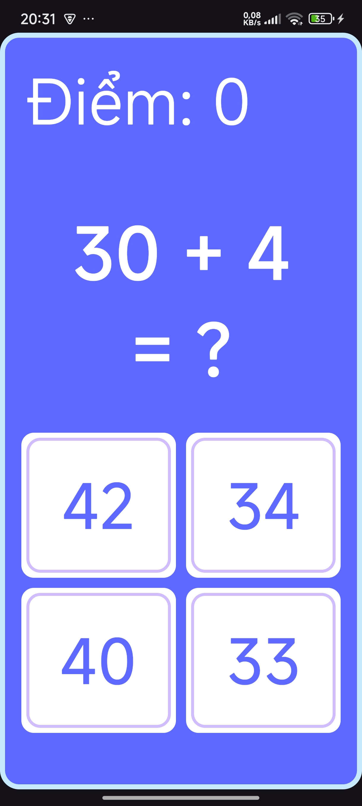

# 🎥 Demo Video

https://github.com/JulianNguyen05/Android_Application/issues/1#issue-3477742237

# LamThem Quiz App Total

A simple interactive quiz application built with **Java** and **Android Studio**.
This project was developed as a learning exercise to practice Android UI design, activity lifecycle, and basic event handling.

---

## 📌 Features

* **Score Tracking** – Displays and updates the player’s score dynamically.
* **Random Questions** – Loads a new question after each attempt.
* **Answer Buttons with Layout Highlight** – Clicking an answer highlights the container layout instead of the button itself.
* **Correct Answer Animation** – Correct answers trigger a green highlight with a blinking animation before moving to the next question.
* **Wrong Answer Handling** – Wrong answers turn red and disable only the chosen option.
* **Smooth Transitions** – Fade-out and fade-in animations when switching to the next question.

---

## 🛠️ Tech Stack

* **Language**: Java
* **IDE**: Android Studio
* **UI Framework**: Android XML Layouts with ConstraintLayout & LinearLayout
* **Animations**: AlphaAnimation (blink, fade in/out)

---

## 📂 Project Structure

```
app/src/main/java/th/nguyenhuutrong/th_quizzapp_total/
│── MainActivity.java        # Main activity controlling game logic
│── CauHoi.java              # Model class for quiz questions
│
app/src/main/res/layout/
│── activity_main.xml        # Main UI layout (score, question, and answer buttons)
│
app/src/main/res/drawable/
│── bg_layout.xml            # Background for main container
│── bg_layout_btn.xml        # Default background for answer containers
│── bg_layout_btn_green.xml  # Highlight background for correct answer
│── bg_layout_btn_red.xml    # Highlight background for wrong answer
│── bg_btn.xml               # Default button background
│
app/src/main/res/values/
│── colors.xml               # Custom theme colors (cosmic blue palette, red, green, etc.)
│── strings.xml              # Localized string resources
```

---

## 🚀 Getting Started

### Prerequisites

* Android Studio (latest version recommended)
* JDK 11 or higher
* Android SDK 24+

### Installation

1. Clone this repository:

   ```bash
   git clone https://github.com/yourusername/android-quiz-app.git
   ```
2. Open the project in **Android Studio**.
3. Let Gradle sync and build the project.
4. Run the app on an emulator or physical device.

---

## 🎮 How to Play

1. Start the app.
2. Read the displayed question.
3. Choose one of the four answers.

   * ✅ Correct answer → green highlight, blink effect, then move to next question.
   * ❌ Wrong answer → red highlight, that option becomes disabled, but you can still try other answers.
4. Score updates automatically after each correct answer.

---

## 📸 Screenshots

### 1️⃣ Main Quiz Screen
This is the main quiz interface.  
The app displays a math question at the top, the current score, and four multiple-choice answers.  

![Quiz Screen]


---

### 2️⃣ Correct Answer State
When the user selects the correct answer, the container of that option turns **green** and blinks shortly before moving to the next question.  

![Correct Answer]


---

### 3️⃣ Wrong Answer State
When the user selects the wrong answer, that option turns **red** and becomes disabled.  
The user can still try the remaining options, but the score resets to zero.  

![Wrong Answer]


---

## 🧑‍💻 Author

* **Nguyễn Hữu Trọng (Julian)**
  *Learning Android Development with Java*

---