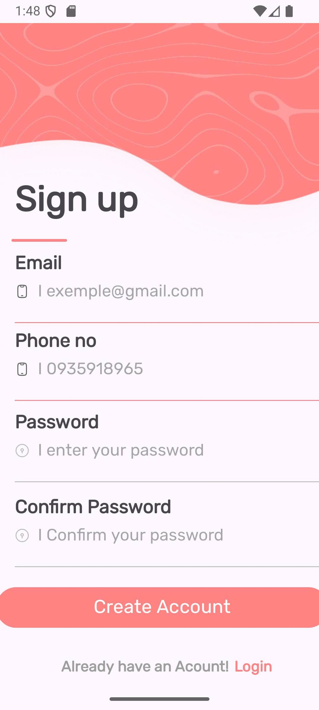

# 📱 TH Simple Layout UI

This is an Android application built with **Java** in **Android Studio**, showcasing a single-page **Sign Up UI** faithfully recreated from the original [Figma design](https://www.figma.com/design/OfwHhZbvlj9otXUpt6lRnA/Simple-Login-%E2%9C%A8--Community-?node-id=92-209&t=2E  lsI3S8WSVqebHb-0).  
The project focuses entirely on **interface design**, without any backend or business logic.

---

## 🚀 Introduction
This application demonstrates how to implement a **modern Sign Up screen** in Android, using:

- **ConstraintLayout** for a flexible and responsive layout structure.  
- **Material Components** (`TextInputEditText`, `Button`) aligned with Material Design guidelines.  
- **Custom fonts and icons** to ensure visual consistency with the Figma design.  

It can serve as a **template** for projects that require a clean, reusable, and modern authentication UI.

---

## 🛠 UI Functionality
Although this project is **UI-only**, the layout is designed to support:

- [x] Input fields for **Email**, **Phone**, **Password**, and **Confirm Password**.  
- [x] Inline icons for enhanced usability (📱 phone, 🔒 lock, 👁 eye).  
- [x] A primary **Create Account** button with standout styling.  
- [x] Navigation text for redirection: *“Already have an account? Login”*.  
- [x] Consistent colors, typography (**Rubik font**), and spacing.  

---

## 📸 Demo

### 🔹 Sign Up Screen

---

## 🛠️ Technology Stack
- **Language:** Java  
- **IDE:** Android Studio  
- **UI Framework:** ConstraintLayout, Material Components  
- **Font:** Rubik  

---

## 📌 Notes
- This is a **UI-only project**.  
- No backend, form validation, or authentication logic is included.  
- Developers may extend it with **Firebase Authentication** or custom APIs as needed.  
