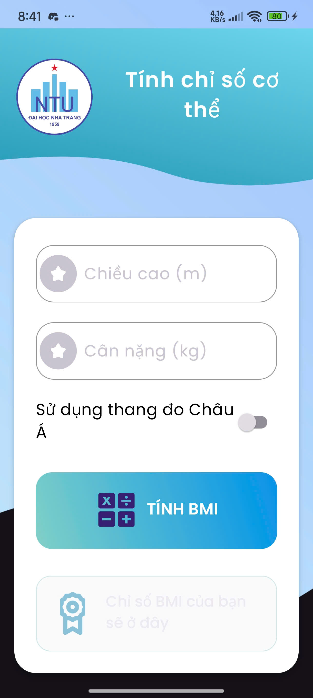
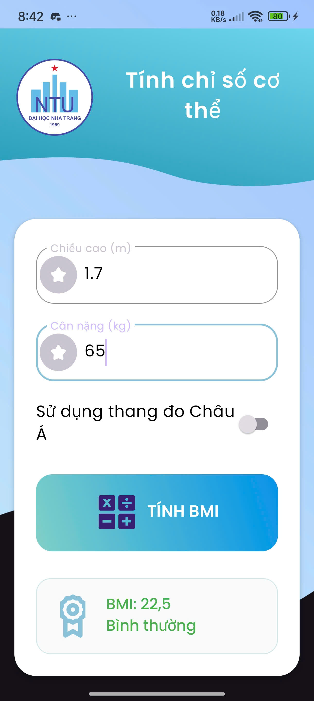
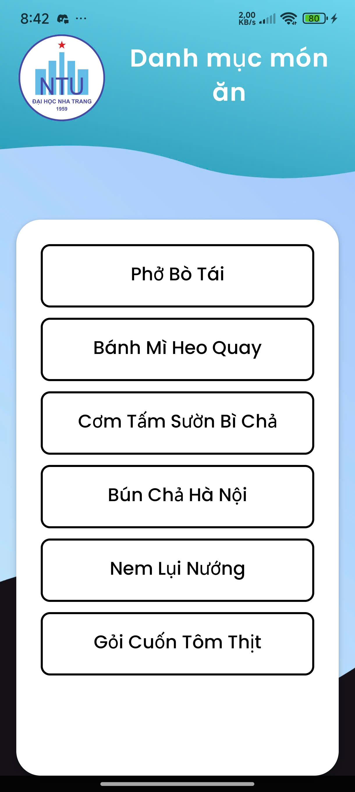
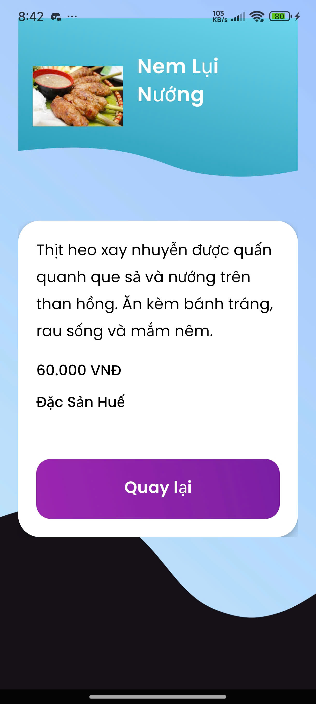
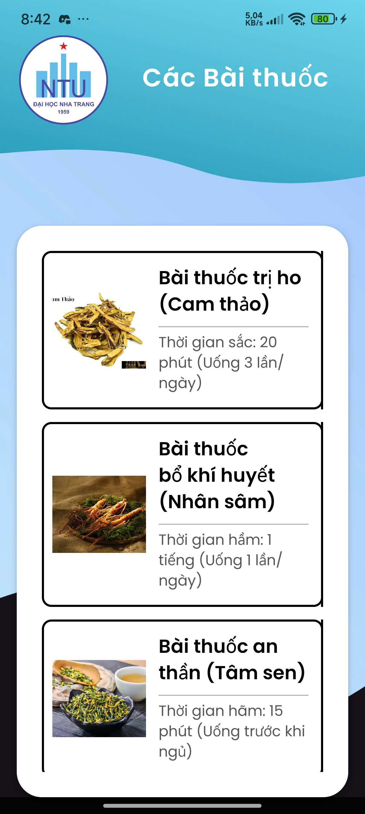
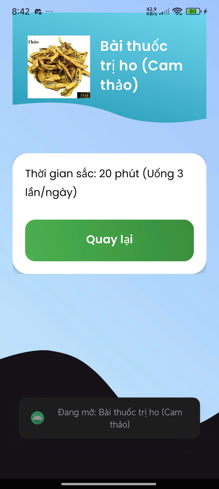
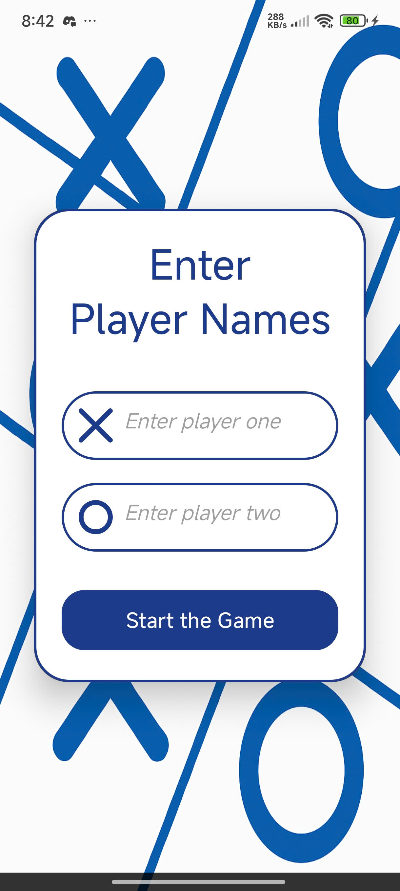
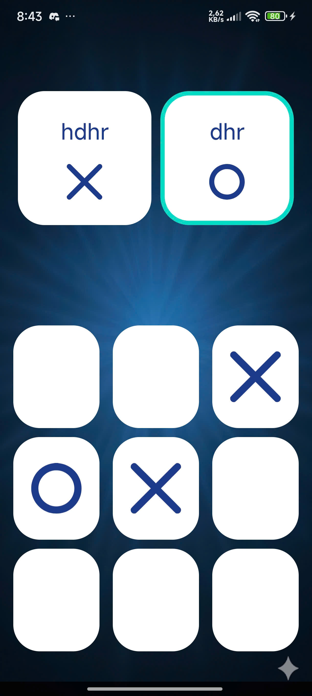

# Demo video
https://github.com/user-attachments/assets/91a95811-0fda-4742-8016-d832bc1c770d

# Demo 

  
  
  
  
  
  
  
  
  
  
    

# Bài thi Giữa kỳ - Lập trình Thiết bị di động

Đây là dự án thi giữa kỳ môn Lập trình Thiết bị di động. Ứng dụng Android này được xây dựng bằng Java, bao gồm nhiều màn hình với các chức năng được yêu cầu trong đề bài.

* **Họ và tên:** [HỌ VÀ TÊN CỦA BẠN]
* **MSSV:** [MÃ SỐ SINH VIÊN]
* **Package:** `thigk2.hovaten` (Theo yêu cầu đề)

---

## 🚀 Các chức năng chính

### 1. Màn hình chính (MainActivity)

* **Mô tả:** Giao diện chính của ứng dụng, đóng vai trò là trung tâm điều hướng.
* **Tính năng:**
    * Hiển thị logo và tên ứng dụng.
    * Bao gồm các `Button` để điều hướng đến 4 chức năng chính: "Tính BMI" (Chức năng 2), "Món ăn" (Chức năng 3), "Bài thuốc" (Chức năng 4), và "Giới thiệu" (About Me).
    * Sử dụng `Intent` để khởi chạy các Activity tương ứng khi nhấn nút.

---

### 2. Chức năng 2: Tính BMI (ActivityChucNang2)

* **Mô tả:** Một công cụ tính toán chỉ số khối cơ thể (BMI).
* **Tính năng:**
    * Giao diện cho phép người dùng nhập **Chiều cao** (mét) và **Cân nặng** (kg) vào `EditText`.
    * Sử dụng `Switch` để người dùng chọn thang đo (Quốc tế hoặc Châu Á).
    * Xử lý sự kiện `onClick` của nút "Tính BMI":
        * Lấy dữ liệu từ `EditText`, kiểm tra dữ liệu đầu vào (không rỗng, lớn hơn 0).
        * Tính toán chỉ số BMI theo công thức: $BMI = \text{cân nặng} / (\text{chiều cao} \times \text{chiều cao})$.
        * Phân loại và hiển thị kết quả (Gầy, Bình thường, Thừa cân, Béo phì) dựa trên thang đo đã chọn.
    * Hiển thị kết quả lên `TextView`.

---

### 3. Chức năng 3: Danh sách Món ăn (ActivityChucNang3 & MonAnDetailActivity)

* **Mô tả:** Hiển thị danh sách các món ăn và thông tin chi tiết của chúng.
* **Tính năng:**
    * **ActivityChucNang3:**
        * Sử dụng `ListView` để hiển thị danh sách tên các món ăn.
        * Đọc và phân tích (parse) dữ liệu từ tệp `list.json` (lưu trong `assets/`) để lấy tên các món ăn.
        * Bắt sự kiện `onItemClick` trên `ListView`.
    * **MonAnDetailActivity:**
        * Khi người dùng nhấn vào một món ăn, ứng dụng chuyển sang màn hình này.
        * Nhận `tenMonAn` được gửi qua `Intent`.
        * Đọc lại tệp `list.json`, tìm đối tượng JSON có `tenMonAn` khớp.
        * Hiển thị thông tin chi tiết (Mô tả, Giá tiền, Nhà hàng) lên các `TextView`.
        * Hiển thị hình ảnh món ăn (từ `res/drawable`) lên `ImageView` dựa trên tên ảnh đọc từ JSON.

---

### 4. Chức năng 4: Danh sách Bài thuốc (ActivityBaiThuoc & BaiThuocDetailActivity)

* **Mô tả:** Hiển thị danh sách các bài thuốc dân gian sử dụng `RecyclerView`.
* **Tính năng:**
    * **ActivityBaiThuoc:**
        * Sử dụng `RecyclerView` để hiển thị danh sách.
        * Sử dụng `BaiThuocAdapter` (Adapter tùy chỉnh) và `BaiThuocModel` (lớp Model).
        * Đọc và phân tích tệp `bai_thuoc.json` (trong `assets/`).
        * Dữ liệu bao gồm: Tên ảnh (String), Tên bài thuốc (String), và Thời gian (String).
        * Bắt sự kiện click thông qua một `Interface` tùy chỉnh trong Adapter.
    * **BaiThuocDetailActivity:**
        * Khi người dùng nhấn vào một bài thuốc, ứng dụng chuyển sang màn hình này.
        * Nhận toàn bộ dữ liệu (ID ảnh, Tiêu đề, Mô tả) qua `Intent`.
        * Hiển thị thông tin chi tiết lên các `ImageView` và `TextView`.

---

### 5. Màn hình Giới thiệu (ActivityAboutMe)

* **Mô tả:** Hiển thị thông tin cá nhân của sinh viên thực hiện.
* **Tính năng:**
    * Hiển thị các thông tin cơ bản như: Họ tên, MSSV, Lớp, và ảnh cá nhân (nếu có).

### 6. Màn hình Làm thêm (Bonus)

* **Mô tả:** Chức năng thưởng, được truy cập từ màn hình chính.
* *(Bạn nên mô tả ngắn gọn chức năng làm thêm của mình ở đây)*

---

## 🛠️ Công nghệ và Kỹ năng sử dụng

* **Ngôn ngữ:** Java
* **UI/Layout:** ConstraintLayout, LinearLayout, ScrollView.
* **Component:** Button, EditText, TextView, Switch, ImageView.
* **Hiển thị danh sách:**
    * `ListView` (với `ArrayAdapter`).
    * `RecyclerView` (với `Adapter` tùy chỉnh, `ViewHolder`, và `Model`).
* **Xử lý dữ liệu:** Đọc và phân tích tệp JSON (sử dụng `JSONObject`, `JSONArray`) từ thư mục `assets`.
* **Điều hướng:** Quản lý Activity và `Intent` (bao gồm truyền dữ liệu qua `Intent extras`).
* **Xử lý sự kiện:** `setOnClickListener`, `setOnItemClickListener`.
* **Xử lý ảnh:** Tải ảnh từ `res/drawable` dựa trên tên động (sử dụng `getIdentifier`).