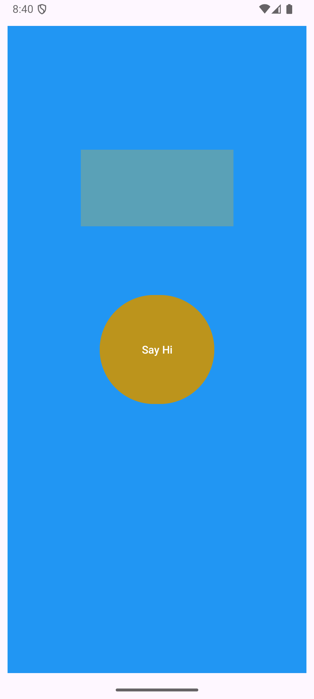
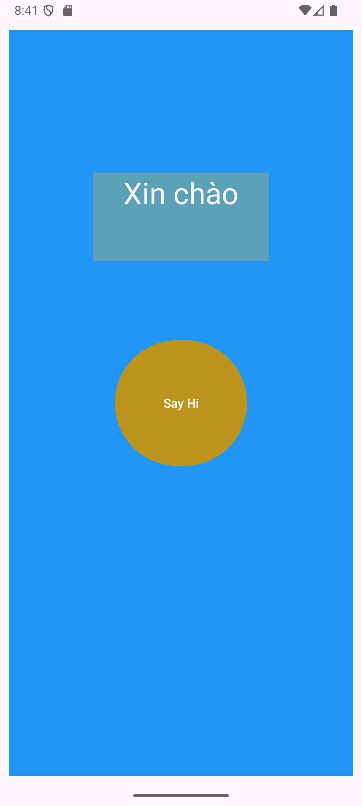

# 📱 Vi Du Layout 1

This is a basic Android application written in **Java** and **Android Studio**, the purpose is to help you get familiar with:
- User Interface (UI) with **ConstraintLayout**
- Using `TextView` and `Button`
- Handling click events in **Activity**

---

## 🚀 Features
- Display a screen with a **"Say Hi"** button
- When the user presses the button, the application will display the text **"Hello"** on the screen

---

## Demo

### Trước khi bấm nút

### Sau khi bấm nút

## 🛠️ Technology used
- **Language:** Java
- **IDE:** Android Studio
- **SDK:** AndroidX (AppCompat, ConstraintLayout) 