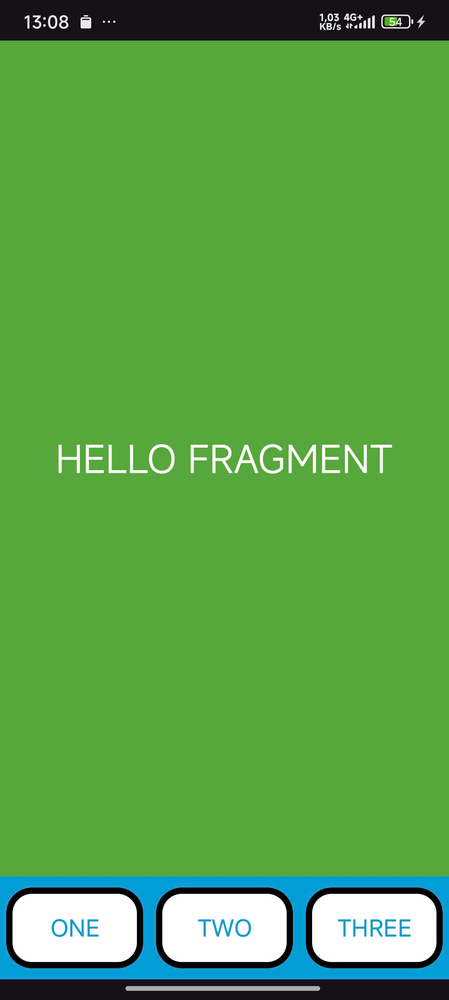
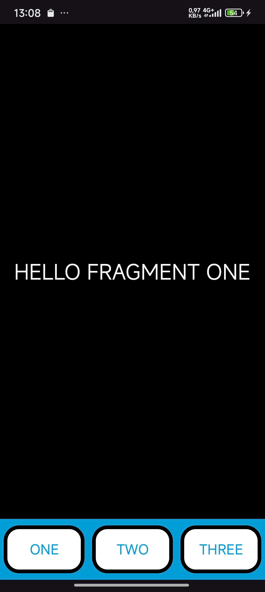
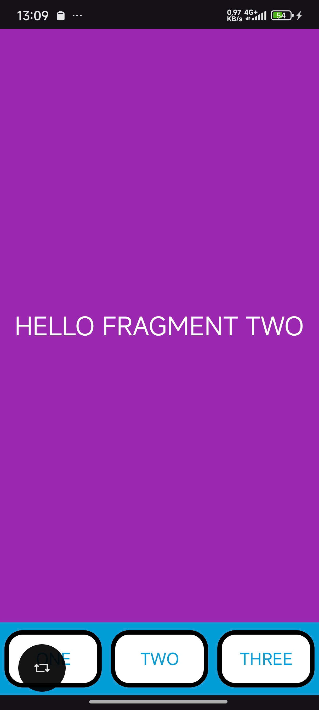
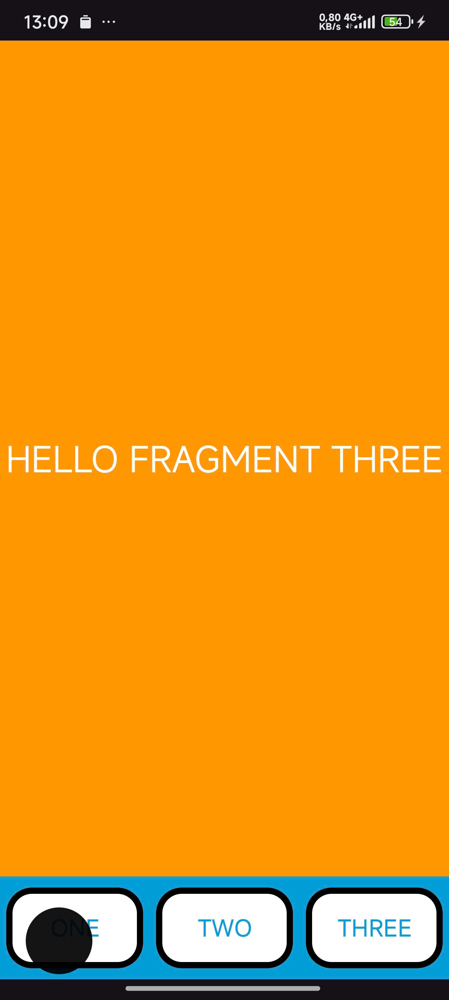

# ViDu Fragment Replacement Dynamically

This project is a sample Android application designed to demonstrate a core concept: **dynamic fragment replacement**. It illustrates how to build a modern, flexible user interface where one fragment (acting as a controller or navigation) can change the content of another fragment container at runtime.

This pattern is the foundation for most modern Android navigation, such as Bottom Navigation Bars, tabbed layouts, and master-detail flows.

## Preview

https://github.com/user-attachments/assets/1a1bc71f-129d-4d7b-9e2e-4e15016f8890

  
  
  
   

## 💡 Core Concepts Illustrated

This application provides a practical, hands-on example of:

* **Fragment-to-Fragment Communication:** The `FooterFragment` communicates with the `MainActivity`'s layout to control other fragments.
* **Dynamic `FragmentTransaction`:** Instead of being statically defined in XML, content fragments (`Fragment1`, `Fragment2`, etc.) are added and replaced programmatically using `FragmentManager.beginTransaction()`.
* **`replace()` Operation:** The `.replace()` method is used to swap out the current fragment in a container with a new one.
* **`getParentFragmentManager()`:** The `FooterFragment` correctly uses `getParentFragmentManager()` to get access to the `FragmentManager` of the host `Activity`, allowing it to manage other fragments in that activity's layout.
* **Composite UI with `FragmentContainerView`:** The main screen (`activity_main.xml`) is composed of two independent `FragmentContainerView`s, one for content and one for the footer, arranged using `ConstraintLayout`.

## ⚙️ How It Works: A Step-by-Step Breakdown

1.  **Layout Setup (`activity_main.xml`):**
    * The main layout is split into two containers: `fragmentContainerView_Content` and `fragmentContainerView_Footer`.
    * `fragmentContainerView_Footer` statically loads the `FooterFragment` using the `android:name` attribute.
    * `fragmentContainerView_Content` statically loads an initial `ContentFragment` (which will be replaced).

2.  **The Controller (`FooterFragment.java`):**
    * This fragment contains the logic for the three buttons (`b1`, `b2`, `b3`).
    * In `onCreateView`, it gets a reference to the parent's `FragmentManager`.
    * An `OnClickListener` is set for each button.

3.  **The Transaction (Button Click):**
    * When a button (e.g., `b1`) is clicked, its listener executes.
    * It creates a new `FragmentTransaction` from the `fragmentManager`.
    * It calls `.replace(R.id.fragmentContainerView_Content, new Fragment1())`. This tells the `FragmentManager` to find the container with the ID `fragmentContainerView_Content` and replace whatever fragment is inside it with a *new instance* of `Fragment1`.
    * Finally, `.commit()` executes the transaction.

4.  **The Result (`fragment_1.xml`):**
    * The `fragmentContainerView_Content` is updated, and the UI defined in `fragment_1.xml` (a black background with the text "HELLO FRAGMENT ONE") is displayed to the user.
    * Clicking `b2` or `b3` repeats this process with `Fragment2` and `Fragment3`, respectively.

## 🛠️ Technologies Used

* **Android SDK**
* **Android Fragments:**
    * Dynamic `FragmentTransaction`
    * `FragmentManager`
    * `getParentFragmentManager()`
* **`androidx.fragment.app.FragmentContainerView`:** The modern, recommended container for hosting fragments.
* **`androidx.constraintlayout.widget.ConstraintLayout`:** For efficiently positioning the UI components.
* **Java:** For application logic.

## 🚀 How to Run

1.  Ensure you have `Fragment2.java`, `Fragment3.java`, and their corresponding layout files (`fragment_2.xml`, `fragment_3.xml`) as well as `fragment_footer.xml` created in your project.
2.  Clone this repository.
3.  Open the project in Android Studio.
4.  Build and run on an Android emulator or physical device.
5.  Click the "ONE", "TWO", and "THREE" buttons in the footer to see the content fragment change.

---

## 🧑‍💻 Author

  * **Nguyễn Hữu Trọng (Julian)**
    *Learning Android Development with Java*