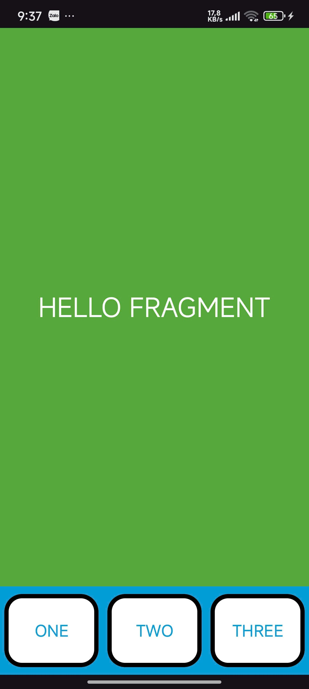

# ViDu Fragment Statically

This is a sample Android application built to demonstrate the static implementation of Fragments within an Activity. It showcases how to build a composite user interface by combining multiple, independent fragment layouts into a single screen, a common pattern for creating reusable UI components.

## Preview

<div style="display: flex; gap: 10px;">
  
</div>


## 💡 Core Concepts Illustrated

This project provides a clear example of several fundamental concepts in Android development:

* **Static Fragment Inclusion:** Both fragments (`ContentFragment` and `FooterFragment`) are added directly into the `activity_main.xml` layout file. This contrasts with dynamic inclusion, where fragments are added or replaced at runtime using a `FragmentManager` transaction.
* **Composite UI:** The main activity's screen is composed of two distinct, reusable UI modules:
    * A main content area (`ContentFragment`).
    * A persistent footer bar (`FooterFragment`).
* **`FragmentContainerView`:** The project correctly uses `androidx.fragment.app.FragmentContainerView` as the modern, recommended container for hosting the `ContentFragment`. This view provides better support for fragment transactions and lifecycle management compared to the older `<fragment>` tag.
* **`ConstraintLayout` for Positioning:** The root layout (`activity_main.xml`) uses `ConstraintLayout` to effectively manage the positions of the fragments. The `fragmentContainerView` is constrained to the top and to the top of the `frgFooter`, while the `frgFooter` is constrained to the bottom of the parent, ensuring the content fills all available space above the footer.

## 📁 Project Structure

Here are the key layout files that make up this demonstration:

* `activity_main.xml`: The main activity's layout. It acts as the host for the two fragments and defines their positions on the screen using `ConstraintLayout`.
* `fragment_content.xml`: The UI for the main content area. It consists of a simple `FrameLayout` with a green background and a centered `TextView`.
* `fragment_footer.xml`: The UI for the footer bar. It uses a `LinearLayout` with a horizontal orientation to evenly space three `Button` components.

## 🛠️ Technologies Used

* **Android SDK**
* **Android Fragments:** Specifically static fragment inclusion.
* **XML Layouts**
* **`androidx.constraintlayout.widget.ConstraintLayout`:** For flexible and efficient UI positioning.
* **`androidx.fragment.app.FragmentContainerView`:** The standard container for hosting fragments.
* **Material Design Components:** For styled `Button` elements in the footer.

## 🚀 How to Run

1. Clone this repository:

   ```bash
   git clone git@github.com:JulianNguyen05/Android_Application.git
   ```
2. Open the project in **Android Studio**.
3. Let Gradle sync and build the project.
4. Run the app on an emulator or physical device.

## 🧑‍💻 Author

  * **Nguyễn Hữu Trọng (Julian)**
    *Learning Android Development with Java*

-----