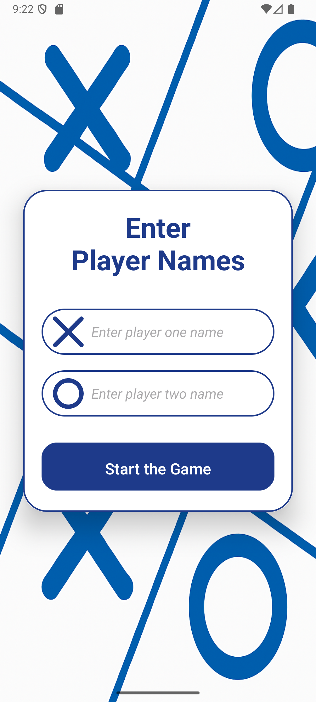

# 📌 LamThem TicTacToe

## 📝 Introduction
The **purpose** of this project is to build a simple **Tic Tac Toe (X-O)** game using **Java** and **Android Studio**.  
It demonstrates **event-driven programming**, **UI handling**, and **activity lifecycle management**.

---

# 📚 Core Library: AppCompatActivity

## 🔹 Introduction
At the heart of Android’s modern application development lies the `AppCompatActivity` class, part of the **AndroidX AppCompat library**.
This class provides compatibility support for older versions of Android while giving access to the latest Material Design components and lifecycle handling.

Both `MainActivity.java` and `AddPlayers.java` in this project extend from `AppCompatActivity`, making it the **foundation for Activity-based UI components**.
---

## 🔹 Installation & Setup
Before using `AppCompatActivity`, you need to ensure your project is set up correctly:

### Step 1: Enable ViewBinding (optional but recommended)
In your `build.gradle (Module: app)` file, enable ViewBinding to simplify UI element references:
  ```
    android {
      ...
      buildFeatures {
          viewBinding true
      }
    }
  ```


Before using AppCompatActivity, you need to ensure your project is set up correctly:

## 🔹 Purpose of AppCompatActivity
- Ensures **compatibility** with older Android versions while supporting the latest APIs.  
- Provides **Material Design UI components** (ActionBar, Toolbar, themes).  
- Manages the **activity lifecycle** reliably.  
- Supports integration with **fragments**, **lifecycle-aware components**, and **Jetpack libraries**.  
- Enables a consistent **event handling system** for UI interactions.  

---

## 🔹 Usage in This Project (MainActivity.java)
In this TicTacToe project, `MainActivity` extends `AppCompatActivity` to leverage its features.


## ⚙️ Setup & Usage Guide for AppCompatActivity

Before importing and using **AppCompatActivity**, some project setup steps are required.  

### 1️⃣ Enable View Binding  
Open your `build.gradle (Module: app)` file and enable **viewBinding**:  

```gradle
android {
    ...
    buildFeatures {
        viewBinding true
    }
}

2️⃣ Import AppCompatActivity

Once the setup is complete, you can import the AppCompat library into your Activity class:

import androidx.appcompat.app.AppCompatActivity;

3️⃣ Extend AppCompatActivity

Make your activity extend AppCompatActivity to access its lifecycle methods and compatibility features:

public class MainActivity extends AppCompatActivity {
    @Override
    protected void onCreate(Bundle savedInstanceState) {
        super.onCreate(savedInstanceState);
        setContentView(R.layout.activity_main);
    }
}

4️⃣ Why Use AppCompatActivity?

Provides backward compatibility across older Android versions.

Supports Material Design components consistently.

Offers robust lifecycle management for activities.

Works seamlessly with viewBinding for cleaner UI code.


🏗️ Core Library Used

androidx.appcompat.app.AppCompatActivity

This is one of the most important libraries in Android development. It is part of the AndroidX support libraries and provides:

Backward compatibility: Ensures that modern Android features work on older Android versions.
Enhanced Activity features: Extends the base Activity class with additional functionality such as toolbar support, theming, and compatibility with Material Design components.
Lifecycle handling: Integrates smoothly with modern Android lifecycle-aware components.

By extending AppCompatActivity, the application gains access to a wide range of UI compatibility features and can provide a consistent user experience across different Android devices and OS versions.


nói về thư viện này import androidx.appcompat.app.AppCompatActivity;

## 📝 Introduction

* Briefly introduce the project.
* Mention the **purpose** and **problem it solves**.
* Add some context (e.g., coursework, personal project, real-world use case).

---

## 🚀 Technologies & Libraries

List all key technologies and libraries used. Example:

* **Language**: Java / Python / C# ...
* **Frameworks**: Android SDK, Spring Boot, .NET, etc.
* **Libraries**:

  * `LibraryName` → explain what it does.
  * `LibraryName` → explain its role.

---

## 🔑 Core Algorithms / Concepts

Highlight the important algorithms or programming concepts implemented:

1. **Algorithm/Concept 1** → short explanation.
2. **Algorithm/Concept 2** → short explanation.
3. **Design Pattern / Architecture** (if any, e.g., MVC, MVVM).

---

## ✨ Features

* Feature 1
* Feature 2
* Feature 3
  (Add screenshots/gifs here if possible to make it visual).

---

## 📂 Project Structure

Show the folder/file structure (optional but professional). Example:

```
project/
│── src/
│   ├── MainActivity.java
│   ├── utils/
│   └── ...
│── assets/
│── README.md
```

---

## ▶️ Installation & Usage

Explain how to run the project:

1. Clone the repository

   ```bash
   git clone https://github.com/your-username/project-name.git
   ```
2. Install dependencies
3. Run the application

---

## 📊 Example (Usage / Demo)

Provide a short example of how to use your project:

```java
// Example usage code
MainActivity activity = new MainActivity();
activity.run();
```

Or show screenshots/gifs of the application in action.

---

## 🔮 Future Improvements

* Suggest what could be improved or added in future.

---

## 👨‍💻 Author

* Name, contact, or link to portfolio/GitHub.

---

## 📜 License

(Optional) Add license info if the project is public.

---


# 🎮 LamThem Tic Tac Toe  

An Android application built with **Java** in **Android Studio**, featuring a clean and modern **start screen**.  
The design focuses on a **cosmic blue theme**, providing a stylish and engaging interface for entering player names and starting the game.  

---

## ✨ Features  
- Simple and modern UI layout  
- Designed with **cosmic blue** theme  
- Ready to extend with game logic and navigation  

---

## 📸 Demo Screenshot  
| Add Players Screen |  
|---------------------|  
|  |  

**Description:**  
- 🎨 Sleek design with a **cosmic blue color palette**  
- 📝 Input fields for **Player One** and **Player Two** names  
- ▶️ A prominent **Start Game** button  
- 📱 Built with layout `ConstraintLayout`, `LinearLayout`, `CardView`, styled `EditText`, `TextView`, and `Button` 

---

## 🚀 Next Steps  

- 🎨 **Design Layouts**  
  - Create `main_activity.xml` for the main screen (tic-tac-toe board, 3x3 grid, player turns).  
  - Create a **result layout** to display the winner or a draw.  

- 🧩 **Add Game Logic**  
  - Implement the **tic-tac-toe board** (3x3 grid).  
  - Handle **player turns** (Player One vs Player Two).  
  - Define **win conditions** (rows, columns, diagonals).  
  - Show the **result** and navigate to the result layout.  
  - Store **player names and scores** for multiple rounds tracking.  

---

## 🛠 Technology Stack  
- **Language:** Java  
- **IDE:** Android Studio

---

## 📌 Notes  
- Currently, the project showcases the **UI layout only**.  
- Backend, game rules, and score handling will be implemented in future updates.  